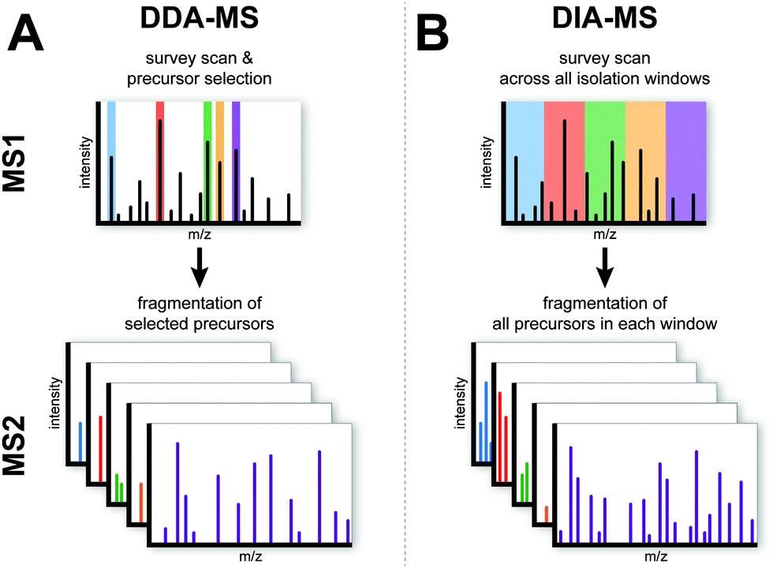
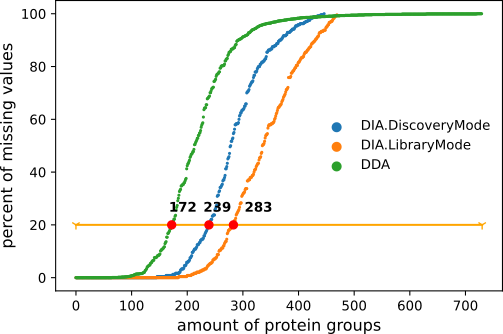
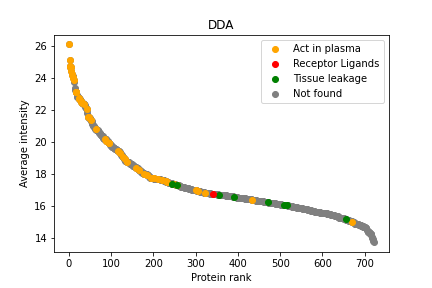
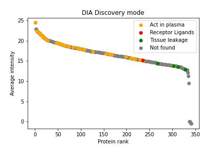
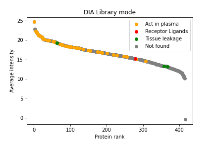

# Сравнительный анализ методов изучения протеома плазмы крови

Этот проект посвящен сравнению двух методов протеомики: DDA и DIA

## DDA

DDA - метод, когда масс-спектрометр сканирует и выбирает наиболее интенсивные ионы пептидов на первом этапе тандемной масс-спектрометрии, а на втором этапе - фрагментирует и анализирует именно их. Проблема метода в том, что сложно определить количество пептидов с низким содержанием.

## DIA

DIA - метод был разработан достаточно давно, но именно сейчас стало возможно его реализовать. Он позволяет анализировать количество всех пептидов, найденных в масс-заряд окнах, что дает возможность получить данные всех пептидов независимо от их представленности. Здесь есть небольшая проблема - для получения этих данных нужны надежные высокоточные и чувствительные масс-спектрометры с квадрупольными анализаторами(Orbitrap).

# Задача

Моей целью в данном исследовании было сравнить два метода, проаназировав данные двух больших исследований с 1000 образцами плазмы крови. Сравнить статистику пропущенных в данных DDA и DIA, а также в спектральной библиотеке пептидов. Ее, кстати, используют для контроля ложных совпадений пептидов. Второй задачей было по данным [исследования](https://www.embopress.org/doi/full/10.15252/msb.20156297) определить, к какому классу принадлежит белок: к функциональным, к белкам утечки тканей или к сигнальным молекулам.

# Результаты

На этом графике видно, что количество найденных белков в данных DDA выше, однако пропущенных значений меньше в DIA.

Здесь иллюстрируется то, что интенсивность в данных DIA выше, чем в DDA, а представленность групп белков не зависит от метода.

Посмотреть, что делали мои коллеги в этом проекте можно [здесь](https://github.com/pgsin/BISS_2021_SIN)

